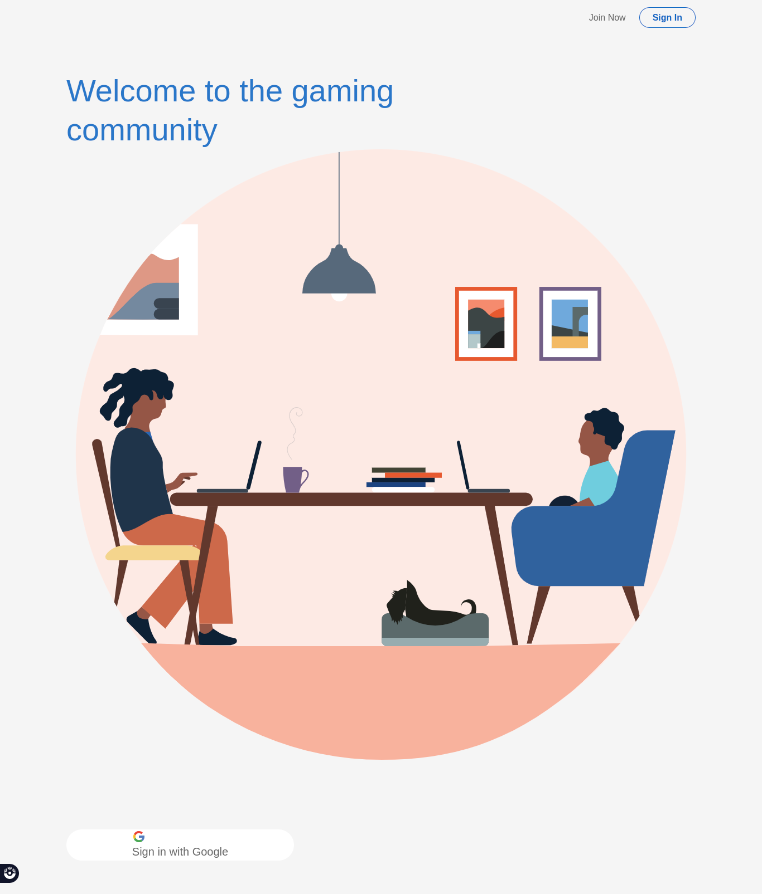
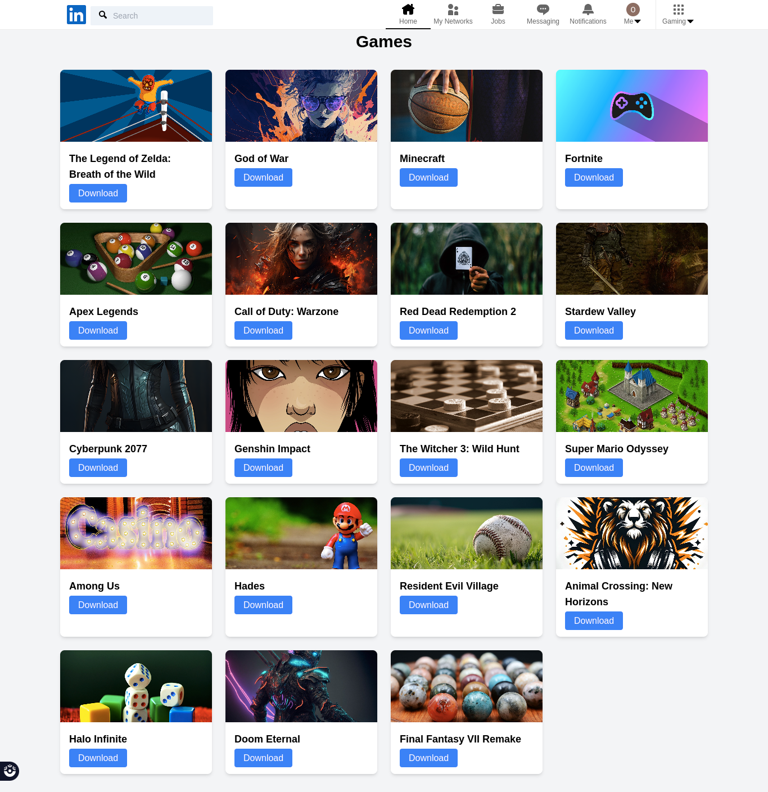
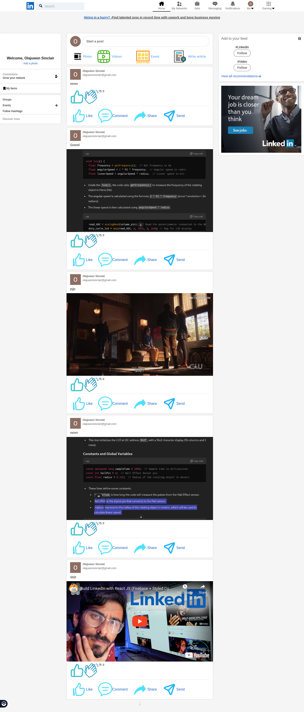
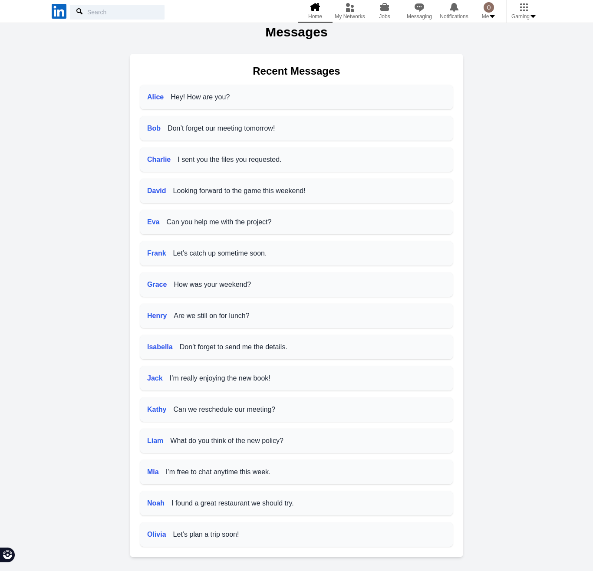
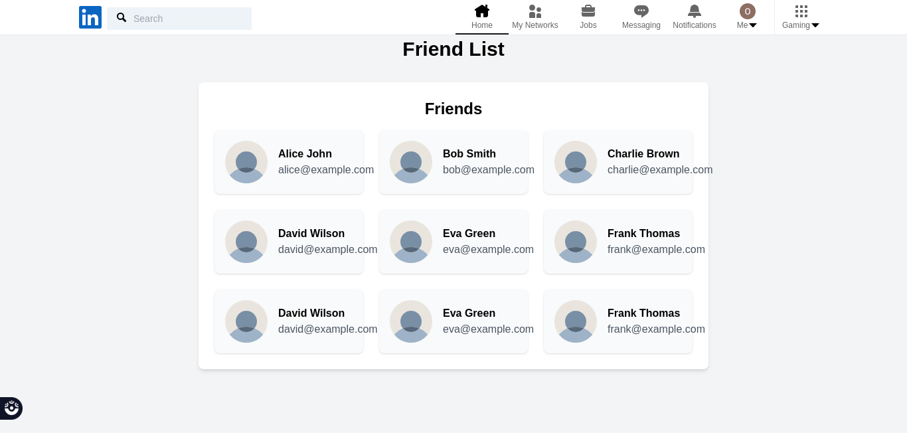
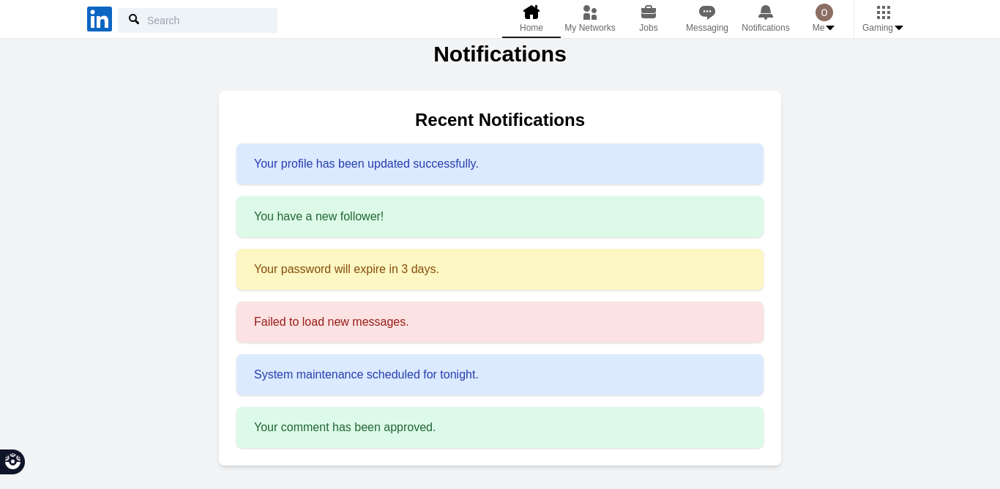

# My Professional Gaming Community

## Table of contents

- [Overview](#overview)
  - [The challenge](#the-challenge)
  - [Screenshot](#screenshot)
  - [Links](#links)
- [My process](#my-process)
  - [Built with](#built-with)
  - [What I learned](#what-i-learned)
  - [Continued development](#continued-development)

- [Author](#author)

## Overview

### The challenge

User are able

- Login using their gmails,
- They are able to post

### Screenshot

(desktop image)

### Links

- Solution URL: [solution URL](https://github.com/sinclare210/linkeldn_clone)
- Live Site URL: [live site URL](https://linkeldn-clone-wb85.vercel.app/)

## My process

### Built with

- JSX
- Tailwind CSS
- Flexbox
- Styled Component
- React
- Firebase

### What I learned

This project was an inspiration from chat gpt, while building this project i learnt about styled component, that enables you to style a component in react, i learnt about react reducers, react routing.

### Continued development

Working on  more responsiveness

## Author

- Frontend Mentor - [@sinclare210](https://www.frontendmentor.io/profile/sinclare210)
- Twitter - [@Sincla1Olajuwon](https://x.com/Sincla1Olajuwon?t=9Rl_pnqS5YlDRBy-PVlhWQ&s=09)

